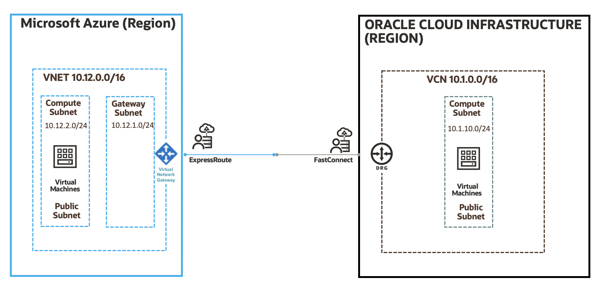

# oci-azure-interconnect

In this repository you will be creating a new setup based on below architecture to setup an Interconnect circuit between Oracle Cloud and Microsoft Azure. 

## Architecture Diagram 




## Prerequisites

You should complete below pre-requisites before proceeding to next section:
- You have an active Oracle Cloud Infrastructure Account and pre-requisites to access Oracle Cloud are setup properly.
- You have an active subscription to Microsoft Azure
- Permission to `manage` the following types of resources in your Oracle Cloud Infrastructure tenancy and Microsoft Azure: `vcns`, `internet-gateways`, `route-tables`, `security-lists`, `subnets`, `instances`, `vnet`, `vnet gateways`.

Tested enviornment: 
```
➜  oci-azure-interconnect git:(main) terraform -v 

Your version of Terraform is out of date! The latest version
is 0.14.7. You can update by downloading from https://www.terraform.io/downloads.html
Terraform v0.13.0
+ provider registry.terraform.io/hashicorp/azurerm v2.20.0
+ provider registry.terraform.io/hashicorp/http v2.1.0
+ provider registry.terraform.io/hashicorp/oci v4.15.0
```

## Deployment 

You can follow below setps to deploy this setup in your account: 

1. Create a local copy of this repo using below command on your terminal: 

    ```
    https://github.com/oracle-quickstart/oci-azure-interconnect.git
    cd oci-azure-interconnect/new-vcn-vnet
    ls
    ```

2. Make sure you have terraform v0.13+ cli installed and accessible from your terminal.

    ```bash
    ➜  oci-azure-interconnect git:(main) terraform -v 

    Your version of Terraform is out of date! The latest version
    is 0.14.7. You can update by downloading from https://www.terraform.io/downloads.html
    Terraform v0.13.0
    + provider registry.terraform.io/hashicorp/azurerm v2.20.0
    + provider registry.terraform.io/hashicorp/http v2.1.0
    + provider registry.terraform.io/hashicorp/oci v4.15.0
    ```

3. Create a `terraform.tfvars` file in your **oci-azure-interconnect** directory, and specify the following variables:

    ```
    # Authentication
    tenancy_ocid         = "<tenancy_ocid>"
    user_ocid            = "<user_ocid>"
    fingerprint          = "<finger_print>"
    private_key_path     = "<pem_private_key_pem_file_path>"

    # SSH Keys
    ssh_public_key  = "<public_ssh_key_string_value>"

    # Region
    region = "<oci_region>"

    # Compartment
    compartment_ocid = "<compartment_ocid>"
    availability_domain_number = "<availability_domain_number>

    ## Azure Variables 
    bandwidth="<virtial_cricuit_bandwidth>"
    azure_region="<azure_region>"
    peering_location="<peered_location>"
    ````

4. Login to Microsoft Azure from CLI using **az login**. If you don't have Azure CLI utility installed locally you will have to do that first.  Verify you have `az account set --subscription` if you have multiple subscriptions, etc. as described here: https://registry.terraform.io/providers/hashicorp/azurerm/latest/docs/guides/azure_cli.html

5. Create the Resources using the following commands:

    ```bash
    terraform init
    terraform plan
    terraform apply
    ```

6. At this point your circuits should be up and you can connect to test VMs on both end and validate connectivity using ping/ssh and check latency. 

7. If you no longer require your infrastructure, you can run this command to destroy the resources:

    ```bash
    terraform destroy -target azurerm_virtual_network_gateway_connection.virtual_network_gateway_connection
    ```
    > Note: End user noticed virtual circuit goes in failed state during deletion. So you should delete the circuit connection first and then continue with destroy command.

    ```bash
    terraform destroy 
    ```

## Feedback 

Feedbacks are welcome to this repo, please open a PR if you have any.
